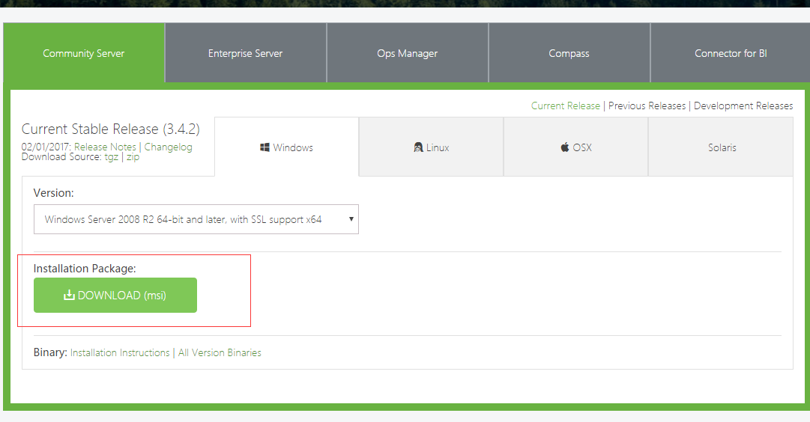
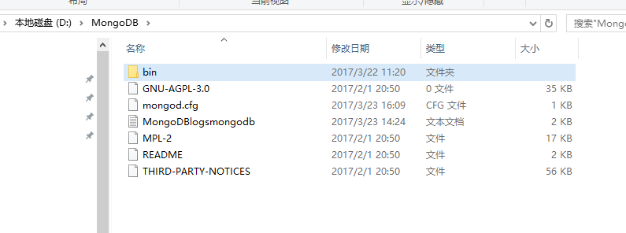
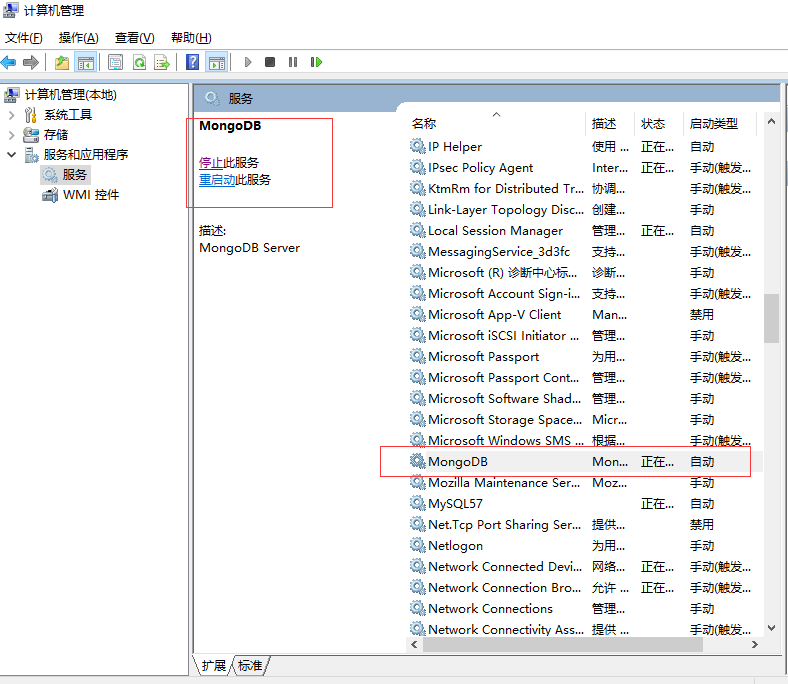

# Windows 安装 MongoDB

> 下载MongoDB windows版本

[downLoad MongoDB windows](https://www.mongodb.com/download-center#community)



下载完安装到D盘如下图所示：



> 建立存储MongoDB 数据库文件和日志文件文件夹

1. 在当前安装MongoDB安装路径文件夹下新建data文件夹


2. data 文件夹下新建 db和logs文件夹


```bash
mkdir data
cd data
mkdir db
mkdir logs
```
> 设置MongoDB配置文件

1. 在根文件目录新建mongod.cfg


```bash
touch mongod.cfg
```
2. 配置文件里输入内容

```bash
systemLog:
    destination: file
    path: D:\MongoDB\data\logs\mongod.log
storage:
    dbPath: D:\MongoDB\data\db
```
- 设置MongoDB 库文件在 D:\MongoDB\data\db路径下
- 设置MongoDB 日志文件在 D:\MongoDB\data\logs\mongod.log

> 把MongoDB 配置为windows服务

```bash
mongod --config "D:\MongoDB\mongod.cfg" --install  --serviceName MongoDB --serviceDisplayName MongoDB

```

看到下图效果说明成功了



> 启动MongoDB服务

```bash
net start MongoDB
```
> 关闭MongoDB服务

```bash
net stop MongoDB
```
> 链接MongoDB

- 如果windows mongo command not found 配置环境path后边加入D:\MongoDB\bin 然后运行

```bash
mongo 
```


